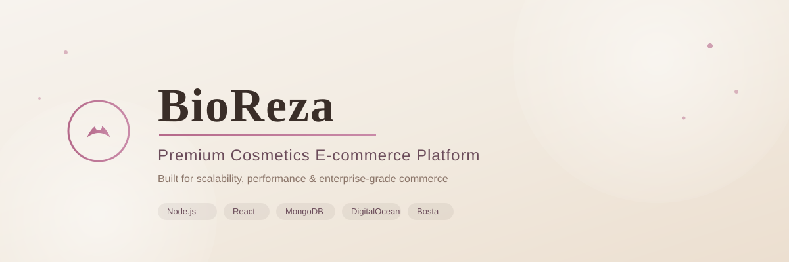

<p align="center">
  
</p>

<p align="center">
  
</p>

<h1 align="center">BioReza</h1>

<p align="center">
  <b>Premium Cosmetics E-commerce Platform</b><br/>
  Built for scalability, performance, and enterprise-grade commerce.
</p>

<p align="center">
  
</p>

<p align="center">
  
  
  
  
  
  
  
  
  
  
</p>

<p align="center">
  
  
  
  
</p>

<p align="center">
  <a href="#-about">About</a> •
  <a href="#-features">Features</a> •
  <a href="#-architecture">Architecture</a> •
  <a href="#-tech-stack">Tech Stack</a> •
  <a href="#-integrations">Integrations</a> •
  <a href="#-getting-started">Getting Started</a> •
  <a href="#-roadmap">Roadmap</a>
</p>

<p align="center">
  
</p>

---

## 📖 Table of Contents

- [About](#-about)
- [Why BioReza](#-why-bioreza)
- [Features](#-features)
- [Architecture](#-architecture)
- [Repositories](#-repositories)
- [Tech Stack](#-tech-stack)
- [Core Modules](#-core-modules)
- [Integrations](#-integrations)
- [Shipping & Logistics (Bosta)](#-shipping--logistics-bosta)
- [Payment Workflow](#-payment-workflow)
- [Notifications](#-notifications)
- [Infrastructure & Deployment](#-infrastructure--deployment)
- [CI/CD](#-cicd)
- [Folder Structure](#-folder-structure)
- [Getting Started](#-getting-started)
- [Environment Variables](#-environment-variables)
- [API Documentation](#-api-documentation)
- [Screenshots](#-screenshots)
- [Roadmap](#-roadmap)
- [Contributors](#-contributors)
- [License](#-license)

---

## 🧴 About

**BioReza** is a production-ready, premium cosmetics e-commerce platform engineered with modern backend architecture and enterprise software practices.

The platform delivers a seamless shopping experience for customers while giving administrators complete control over products, inventory, shipping, payments, analytics, and customer engagement.

BioReza is built with scalability, maintainability, and real-world deployment in mind — not just another CRUD application, but a full commerce system designed to run in production.

---

## 🎯 Why BioReza

<table>
<tr>
<td width="33%">

**🏗️ Premium Architecture**
Clean, modular, and domain-driven design ready to scale.

</td>
<td width="33%">

**🔒 Secure Payments**
Reviewed and validated payment workflow with admin approval.

</td>
<td width="33%">

**🚚 Automated Shipping**
Full Bosta integration from pricing to tracking.

</td>
</tr>
<tr>
<td width="33%">

**📦 Inventory Sync**
Real-time stock reservation and low-stock alerts.

</td>
<td width="33%">

**🔔 Enterprise Notifications**
Email, SMS, and in-app alerts for every order event.

</td>
<td width="33%">

**📊 Analytics Dashboard**
Full visibility into sales, orders, and customer behavior.

</td>
</tr>
</table>

---

## ✅ Features

- ✅ JWT Authentication & Refresh Tokens
- ✅ Role-Based Access Control (RBAC)
- ✅ Email Verification & Password Reset
- ✅ Product Catalog (Products, Categories, Brands)
- ✅ Coupons & Discounts
- ✅ Reviews & Ratings
- ✅ Wishlist & Cart
- ✅ Order Management
- ✅ Bosta Shipping Integration
- ✅ Payment Proof Review Workflow
- ✅ Inventory Reservation System
- ✅ Background Jobs (Queues)
- ✅ Multi-Channel Notifications
- ✅ Admin Dashboard
- ✅ Sales & Traffic Analytics
- ✅ Full Docker Support
- ✅ CI/CD Pipeline

---

## 🏛️ Architecture

```
                      ┌────────────────────┐
                      │      Customer       │
                      └──────────┬──────────┘
                                 │
                                 ▼
                      ┌────────────────────┐
                      │  Frontend (React)   │
                      └──────────┬──────────┘
                                 │
                                 ▼
                      ┌────────────────────┐
                      │   REST API / Nginx  │
                      └──────────┬──────────┘
                                 │
                                 ▼
                      ┌────────────────────┐
                      │  Node.js (NestJS)   │
                      │   Business Services │
                      └──┬────────┬─────┬───┘
                         │        │     │
              ┌──────────┘        │     └──────────┐
              ▼                   ▼                ▼
      ┌───────────────┐  ┌───────────────┐  ┌───────────────┐
      │    MongoDB     │  │     Redis     │  │    BullMQ     │
      └───────────────┘  └───────────────┘  └───────┬───────┘
                                                      │
                                        ┌─────────────┴─────────────┐
                                        ▼                           ▼
                                ┌───────────────┐          ┌───────────────┐
                                │     Bosta      │          │    Paymob     │
                                │   (Shipping)    │          │  (Payments)   │
                                └───────────────┘          └───────────────┘
                                        │
                                        ▼
                              ┌────────────────────┐
                              │    DigitalOcean     │
                              │  (Production Host)  │
                              └────────────────────┘
```

---

## 📦 Repositories

| Repository | Description |
|---|---|
| **BioReza-BE** | Main backend REST API (Node.js / NestJS / TypeScript) |
| **BioReza-FE** | Customer-facing storefront (React) |
| **BioReza-Admin** | Admin dashboard & management portal |
| **BioReza-Shared** | Shared types, DTOs, and contracts |

---

## 🛠 Tech Stack

<p align="center">
  
</p>

### Backend
- Node.js + NestJS + TypeScript
- MongoDB with Mongoose
- Redis (Caching & Sessions)
- BullMQ (Background Jobs & Queues)
- Zod (Validation)
- JWT + Bcrypt (Auth & Security)

### Frontend
- React + Vite
- Tailwind CSS
- React Query
- React Router

### DevOps
- Docker & Docker Compose
- GitHub Actions (CI/CD)
- DigitalOcean (Hosting)
- Nginx (Reverse Proxy)

### Integrations
- Bosta (Shipping & Delivery)
- Paymob (Payment Gateway)
- Resend / SMTP (Emails)
- Cloudinary (Media Storage)

---

## 🧩 Core Modules

<table>
<tr>
<td>🔐 Authentication</td><td>🛍️ Products</td><td>🗂️ Categories</td><td>🏷️ Brands</td>
</tr>
<tr>
<td>📦 Orders</td><td>💳 Payments</td><td>🚚 Shipping</td><td>🔔 Notifications</td>
</tr>
<tr>
<td>📊 Inventory</td><td>🎟️ Coupons</td><td>⭐ Reviews</td><td>❤️ Wishlist</td>
</tr>
<tr>
<td>📍 Addresses</td><td>📈 Analytics</td><td>🖥️ Admin Dashboard</td><td>👥 Users</td>
</tr>
</table>

---

## 🔗 Integrations

<p align="center">
  
  &nbsp;&nbsp;&nbsp;
  
  &nbsp;&nbsp;&nbsp;
  
  &nbsp;&nbsp;&nbsp;
  
</p>

| Service | Purpose |
|---|---|
| 🚚 **Bosta** | Shipping & delivery management |
| 💳 **Paymob** | Payment gateway processing |
| 📧 **Resend / SMTP** | Transactional emails |
| ☁️ **DigitalOcean** | Production hosting & deployment |
| 🐳 **Docker** | Containerization |
| 🍃 **MongoDB** | Primary database |
| ⚡ **Redis** | Caching & queue backend |

> **Note:** Third-party logos are referenced via [Simple Icons](https://simpleicons.org) CDN rather than stored locally, in line with each brand's usage policy.

---

## 🚚 Shipping & Logistics (Bosta)

BioReza integrates with **[Bosta](https://bosta.co)** — Egypt's leading shipping and delivery platform — to provide a complete, automated fulfillment workflow.

<p align="left">
  
</p>

- 📍 Cities & zone resolution
- 💰 Real-time shipping price calculation
- 📦 Automated shipment creation
- 🚚 Live shipment tracking
- 🔄 Webhook-based status updates
- ❌ Shipment cancellation handling

### Shipping Flow

```
Customer → Checkout → Shipping Calculator → Bosta API
   → Shipping Price → Payment → Order Created
   → Shipment Created → Webhook Update → Delivered
```

---

## 💳 Payment Workflow

```
Customer → Checkout → Upload Payment Proof
   → Pending Review → Admin Approval
   → Payment Approved → Order Confirmed
   → Bosta Shipment Created → Delivered
```

Payments are processed through **Paymob**, with an additional manual/admin review layer for proof-of-payment orders — giving full control and fraud protection before a shipment is created.

---

## 🔔 Notifications

BioReza keeps customers and admins informed at every step:

- 📧 Email notifications
- 📱 SMS alerts
- 🔔 In-app notifications
- 🛎️ Admin alerts (new orders, low stock)
- 📦 Order status updates
- 🚚 Shipment status updates
- ⚠️ Low stock alerts

---

## ☁️ Infrastructure & Deployment

```
React (Frontend) → Nginx → Node.js API → Redis → BullMQ
   → MongoDB → Bosta / Paymob → DigitalOcean
```

**Hosted on DigitalOcean**, with:

- 🔒 SSL / HTTPS encryption
- 🔁 Nginx reverse proxy
- 🐳 Fully Dockerized services
- ♻️ Automatic restart policies
- 🌍 Environment separation (dev / staging / production)
- 📜 Centralized production logging

---

## ⚙️ CI/CD

BioReza uses **GitHub Actions** for continuous integration and deployment:

- ✅ Automated linting & type checks
- ✅ Automated tests on pull requests
- ✅ Docker image build & push
- ✅ Automated deployment to DigitalOcean

---

## 🗂 Folder Structure

```
src/
├── auth/
├── products/
├── categories/
├── brands/
├── orders/
├── payments/
├── shipping/
├── notifications/
├── inventory/
├── coupons/
├── reviews/
├── wishlist/
├── addresses/
├── analytics/
├── users/
├── common/
├── config/
├── queues/
└── database/
```

```
docs/
├── logo.png
├── banner.png
├── architecture.png
├── shipping-flow.png
├── payment-flow.png
├── notifications-flow.png
├── deployment.png
├── demo.gif
└── screenshots/
    ├── home.png
    ├── product.png
    ├── checkout.png
    ├── dashboard.png
    └── tracking.png
```

---

## 🚀 Getting Started

### Prerequisites

- Node.js ≥ 20
- Docker & Docker Compose
- MongoDB (local or Atlas)
- Redis

### Installation

```bash
# 1. Clone the repository
git clone https://github.com/your-org/bioreza.git
cd bioreza

# 2. Install dependencies
npm install

# 3. Configure environment variables
cp .env.example .env

# 4. Run with Docker
docker-compose up -d

# 5. Run database migrations / seed (if applicable)
npm run seed

# 6. Start the development server
npm run dev
```

The API will be available at `http://localhost:3000` and the storefront at `http://localhost:5173`.

---

## 🔑 Environment Variables

```env
# App
PORT=3000
NODE_ENV=development

# Database
MONGO_URI=mongodb://localhost:27017/bioreza

# Redis
REDIS_URL=redis://localhost:6379

# Auth
JWT_SECRET=your_jwt_secret
JWT_EXPIRES_IN=7d

# Bosta
BOSTA_API_KEY=your_bosta_api_key
BOSTA_BASE_URL=https://app.bosta.co/api

# Paymob
PAYMOB_API_KEY=your_paymob_api_key

# Email
SMTP_HOST=smtp.example.com
SMTP_USER=your_email
SMTP_PASS=your_password
```

> ⚠️ Never commit your real `.env` file. Use `.env.example` as a template only.

---

## 📘 API Documentation

Full API documentation (Postman collection / Swagger) is available in the `/docs` directory of the backend repository, covering all endpoints for Authentication, Products, Orders, Shipping, and Payments.

---

## 📸 Screenshots

<p align="center">
  
  
</p>
<p align="center">
  
  
</p>

---

## 🛣 Roadmap

- [x] Authentication
- [x] Products & Catalog
- [x] Cart & Wishlist
- [x] Orders
- [x] Payments (Paymob)
- [x] Shipping (Bosta)
- [x] Notifications
- [ ] Loyalty Program
- [ ] AI Product Recommendations
- [ ] Mobile Application
- [ ] Subscription Products
- [ ] Referral System

---

## 🤝 Contributors

<p align="center">
  <a href="https://github.com/your-org/bioreza/graphs/contributors">
    
  </a>
</p>

Contributions, issues, and feature requests are welcome! Feel free to check the [issues page](https://github.com/your-org/bioreza/issues).

---

## 📄 License

This project is licensed under the **MIT License** — see the [LICENSE](./LICENSE) file for details.

---

<p align="center">
  Made with ❤️ by the <b>BioReza</b> Team
</p>
